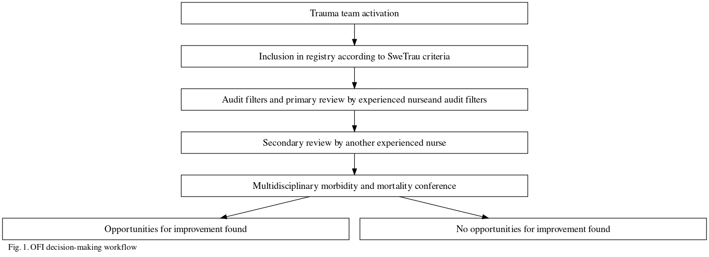
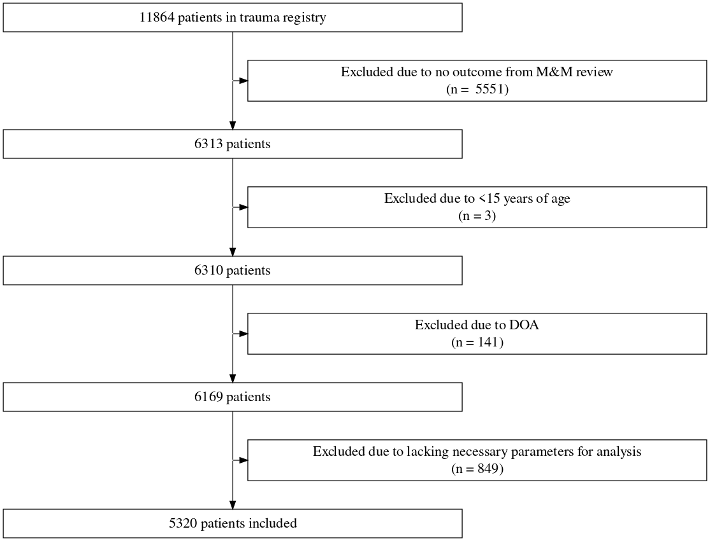
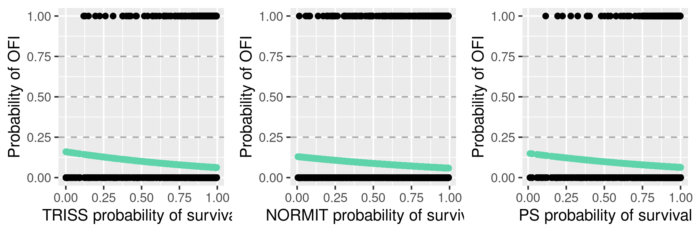
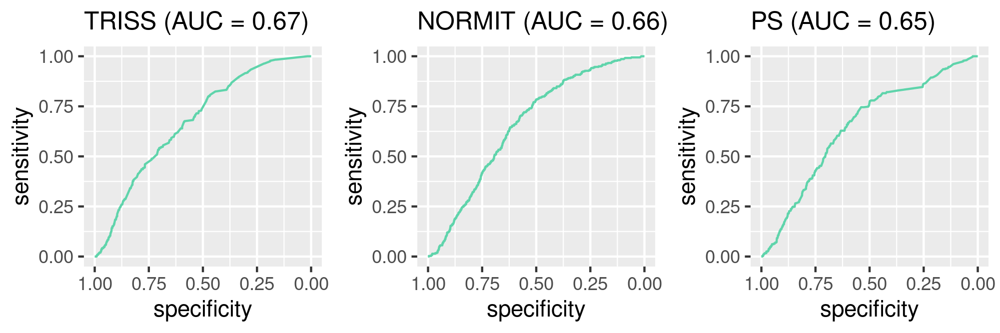
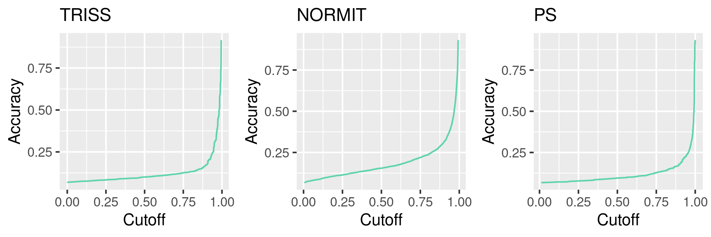

```{r setup, include=FALSE}
knitr::opts_chunk$set(echo = FALSE, warning = FALSE, message = FALSE)
```

```{r main}
  source("main.R") 
```


Abstract
========

<!-- Provide in the abstract an informative and balanced summary of
what was done and what was found. Not more than 300 words. -->


Abbreviations
=============
* ASA-PS - American Society of Anesthesiology Physical Status
* ISS - Injury Severity Score
* M&M - Morbidity and mortality
* NISS - New Injury Severity Score
* NORMIT - Norwegian Survival Prediction Model in Trauma
* OFI - Opportunities for improvement
* PS - Probability of Survival score
* QI - Quality Improvement
* RTS - Revised Trauma Score
* TARN - Trauma Audit & Research Network
* TRISS - Trauma and Injury Severity Score
* WHO - World Health Organisation

Introduction
============
Trauma, defined as the clinical entity composed of physical injury and the body's associated response [@Gerdin2015], is one of the leading causes of death worldwide and accounts for approximately 9% of global deaths annually [@globalburden]. The global health burden of trauma has led to it being described as a worldwide pandemic. One of the characteristics of this particular pandemic is its demographic spread; trauma is a leading cause of death for people aged 10-49 years [@globalburden] and 90% of trauma-related deaths occur in low- to middle-income countries [@whoepi]. Non-fatal outcomes also comprise a significant portion of the global health burden of disability [@globalburden], which can drastically reduce quality of life and health status in survivors of severe trauma [@globalburden; @longtermtrauma]. The quality of trauma care is therefore a globally relevant issue with significance for a great number of people. Improvements in trauma outcomes benefit both the individual and also society at large by reducing the societal and healthcare costs of disability. The significance of the consequences and burden of trauma has been recognised by the UN, who in their Sustainable Development Goals included the aim of reducing the number of global deaths and injuries from road traffic accidents by half by 2020 [@sdg]. The importance of improving trauma care named as one of the strategies in achieving this goal. The goal was not met by 2020 [@sdg20], which is another signal that there is significant progress to be made in trauma care. 

Efforts to advance the state of trauma care have been ongoing for many years. Today many trauma centres have implemented quality improvement (QI) programs, and it has been shown in the US that these programs improve outcomes [@ustqi]. QI programs use many tools, including statistical analysis and audit filters [@hakkenbrakprevdeath], but the gold standard of trauma QI is the multidisciplinary morbidity and mortality (M&M) conference. These conferences review selected patient cases and establish whether there was opportunity for improvement (OFI) in each case. One method of improving the quality of M&M conferences is by improving case selection. This is usually achieved by using audit filters that automatically flag cases for review. One approach is the use of trauma severity models as audit filters. Trauma severity models are algorithms that evaluate trauma severity in quantitative terms. The effectiveness of these models in case selection is understudied and their potential as audit filters is the focus of this paper. 

## Morbidity and mortality conferences

The significance of M&M conferences in trauma QI is a consequence of the unique challenges inherent to trauma care. Management of severe trauma is highly time-sensitive and is also dependent on the actions of a chain of healthcare providers spanning multiple professions and disciplines. Outcomes in severe trauma are dependent on the quality of care received [@ustqi] and errors in management are a common cause of preventable deaths [@prevdeathsghorbani; @prevdeathsmontmany; @prevdeathsteixeira]. Since mistakes by any one provider can lead to severe outcomes, attempts to improve trauma outcomes must seek to improve all aspects of the entire chain of care. This can only be achieved through peer review and consequently, M&M conferences are the cornerstone of trauma QI programs. 

As mentioned, M&M conferences review a selection of patient cases, attempt to establish whether there were opportunities for improvement (OFI) in each specific case, and, where necessary, implement corrective actions. The occurrence of OFI function in this manner as a proxy for incidence of suboptimal care. Regular conferences allow QI programs to identify patterns of errors and provide a basis for systemic quality improvement. To maximise effectiveness, conferences should be attended by all involved specialities and have a structured format. The WHO guidelines for trauma QI programs give specific recommendations as to the structure and format of M&M conferences [@whoguidelines]. Despite theserecommendations, there is a still a great degree of variation amongst clinics in how M&M conferences are carried out, with a significant number of clinics still using an informal and unstructured format [@tqipanglo]. The World Health Organisation (WHO) themselves note in their guidelines that M&M conferences are not used to their fullest potential globally [@whoguidelines]. 

The value of M&M conferences in long-term quality improvement is largely dependent on selection of appropriate cases for review. For example, imagine a conference where every case reviewed was found to have no OFI. The value of that conference would effectively be zero, as it would fail to discover any flaws in trauma care. In an ideal world, only cases that were actually mismanaged would be selected for review; this is, of course, an impossible ideal as it cannot be known whether a case was mismanaged prior to it being reviewed. This reliance on case selection is a weakness of M&M review and has led to considerable efforts to develop strategies to standardise case selection [@tqipanglo]. The WHO recommends that all "deaths, complications, adverse events and errors" should be reviewed [@whoguidelines]. Some clinics have made further advances in standardising case election; most commonly by using quality indicators, or audit filters, to automatically flag cases for inclusion in M&M conferences [@tqipanglo; @developqi]. Examples of audit filters include time to first medical contact, adverse event rate, and, in some clinics, trauma severity models [@developqi; @whoguidelines]. 

The benefit of standardising and automating case selection is twofold; it could increase identification of the cases that are most likely to have been mismanaged, and it could also save resources in the form of work hours. The latter benefit is not insignificant considering the large caseload found in many urban trauma centres. The process of identifying cases is time-consuming and trauma centres that lack resources may not be able to allocate enough staff to case selection, which in turn lowers the effectiveness of M&M review. Despite the benefits of standardised case selection, several studies have shown that the process by which patient cases are selected for M&M review differs between clinics and case selection is often non-standardised [@mmreview; @tqipanglo]. 

## Trauma severity models
Trauma as a clinical entity is highly heterogeneous due to the variety in its underlying causes, which affect both the type and severity of the injury. One of several challenges posed by this heterogeneity is difficulty in expressing the severity of an injury in quantitative terms. For example, it is difficult to intuitively say who was the more severely injured out of a patient with multiple gun shot wounds and a patient who was injured in a high speed road traffic accident. The ability to estimate trauma severity quantitatively is crucial for trauma QI programs as it allows trauma centres to assess outcomes and clinic performance. 
 
Trauma severity models are algorithms that seek to address this need. These models translate anatomical and physiological parameters into a quantitive value that represents the totality of the injury to any given patient. Trauma severity models were initially intended for use in prehospital triage, and therefore were simplistic by design for ease of use [@traumareview], but over the years newer and more advanced algorithms have been developed to fulfil the needs of research, quality assurance, and clinical triage [@traumareview]. Today there are hundreds of trauma severity models that differ in methodology but have the common aim of expressing trauma severity as a numerical value that either directly or indirectly represents the probability of survival. 

Trauma severity models have become a cornerstone of modern trauma QI programs [@historytss].
These models allow clinics to compare their outcomes against an established benchmark. One example of their use is highlighting unexpectedly high mortality rates amongst patients with a high predicted probability of survival. [@whoguidelines]. They also provide a common language for expressing trauma severity, which enables clinics to compare their performance with other, comparable clinics [@whoguidelines].

An inherent weakness of any trauma severity model is that estimates may be unreliable when applied to a population different from the one the model was developed from. This limitation in generalisability is a consequence of the heterogeneity of trauma, as the spectrum of traumatic injury varies across geographical regions [@assessingquality]. This weakness means that there is no single "best" model, as the performance of any model will be best in the population the model was sourced from. This is one reason why new models continue to be developed. Another reason is that efforts to establish which risk factors best predict mortality are still ongoing.

The most commonly used model worldwide is The Trauma and Injury Severity Score (TRISS) [@trissbetter], first developed in the US in 1987 [@triss] and most recently updated in 2010 [@triss2010]. TRISS is a combination index that incorporates patient age, the Injury Severity Score (ISS), the Revised Trauma Score (RTS), and whether the injury was blunt or penetrating [@triss]. One weakness of TRISS is that the RTS requires GCS on arrival at hospital, which cannot be estimated in situations where the patient has already been intubated. This gives TRISS limited value in estimating probability of survival in certain populations [@trissbetter]. Another commonly used model is the Probability of Survival (PS) score, originally developed by the Trauma Audit & Research Network (TARN) in the UK in 2007 [@tarn07]. In some ways the PS model is more complex than TRISS; it has coefficients for sex associated with age, and provides a formula that takes into account the non-linearity of ISS [@tarn07]. 

In 2014 researchers in Norway released a new model, the Norwegian Survival Prediction Model in Trauma (NORMIT), that attempts to address the weaknesses of TRISS and simultaneously provide a model based on Norwegian patient populations [@normit]. NORMIT is based on the patient's age, New Injury Severity Score (NISS), comorbidities prior to traumatic injury based on the ASA physical status classification system (ASA-PS), and their RTS. NISS differs from ISS in that NISS allows for scoring of multiple injuries within the same anatomical region. Validation of NISS has shown that NISS is better at predicting mortality in trauma patients compared to ISS, especially in patients with multiple severe injuries within one anatomical region [@nissbetter]. NORMIT also provides a method to incorporate the GCS for intubated patients when calculating RTS. For patients who arrive at hospital and under general anaesthesia, the RTS is calculated based on the prehospital value prior to intubation [@normit]. NORMIT was updated in 2018 [@skagaValidatingPerformanceTRISS2018] and a validation study found that the updated NORMIT reliably predicted survival at a Swedish trauma centre but both the old and new versions of NORMIT performed worse when used at the national level [@validationnormit]. 


## Knowledge gap

As previously mentioned, some trauma centres use trauma severity models as audit filters in selecting cases for M&M conferences [@whoguidelines]. One example of their use as audit filters is in only reviewing deaths in cases that had a high predicted probability of survival. This strategy is based on the idea that deaths in cases with high predicted survival are more likely to have been preventable deaths. The factor that determines whether a death was preventable is whether an improvement in care could have prevented the death, i.e. whether there was a significant OFI. The use of trauma severity models as audit filters for preventable deaths is therefore based upon the expectation that these models can predict OFI in mortalities. Research to date does not support that trauma severity models can predict OFI in deaths. Two major studies have looked at trauma severity models and preventable deaths. One study in Sweden investigated TRISS and NORMIT [@prevdeathsghorbani] and a study in the UK investigated TRISS and PS [@brohi16]. Both of these studies showed that these studied models were unable to reliably discriminate between preventable and non-preventable deaths and applying cutoffs led to some preventable deaths being missed [@prevdeathsghorbani; @brohi16].

The use of trauma severity models as audit filters is not limited to solely mortalities; some hospitals also use them as audit filters in survivors. However, the extent to which trauma severity models are associated with or can predict OFI as found in M&M conferences is not well understood. The two studies mentioned investigated only preventable deaths and to date there is no published research that investigates whether trauma severity models can predict OFI across the board. 

There is value in determining the effectiveness of trauma severity models in predicting OFI. If they can reliably predict OFI, their use as audit filters would be supported as they would improve case selection for M&M conferences. More accurate case selection will lead to M&M conferences becoming more effective at discovering flaws in care. There is also a secondary benefit in that effective audit filters allow case selection to become more automated, which reduces the large resource burden of identifying cases for review. Conversely, if trauma severity models cannot reliably predict OFI, we would know that their use as audit filters is harmful to the M&M process. Audit filters that are poor predictors can be harmful in two ways. On the one hand, they can over-predict OFI, causing more cases to be reviewed unnecessarily. This reduces the effectiveness of M&M conferences. On the other hand, they can miss cases with OFI, leading to flaws being undetected by M&M conferences. Given that some hospitals already use trauma severity models as audit filters, it is prudent to ascertain whether this is a helpful or harmful feature in the trauma QI process. 


## Aim
The aim of this study is to evaluate how the trauma severity models TRISS, NORMIT and PS are associated with and to what extent they can predict opportunities for improvement.

Methods 
=======

Study design
------------

This is a single-centre retrospective cohort study, using data from two registries at Karolinska University Hospital: the trauma registry and the trauma care quality database. The trauma care quality database is a subset of the trauma registry and contains data on trauma patients who were selected for M&M reviews. These two databases were linked and then analysed to estimate the association between the common trauma severity models TRISS, NORMIT and PS and OFI using logistic regression. The predictive performance of these models was evaluated using measures of discrimination and calibration. 

Setting
-------

Karolinska University Hospital is located in Solna, Sweden. The trauma centre at Karolinska University Hospital is equivalent to a level 1 trauma centre according to American College of Surgeons standards [@nksstats] and it is the primary trauma centre for the region of Stockholm. Karolinska University Hospital also has agreements with several other regions to provide trauma care for patients with severe trauma and the trauma centre has thereby a catchment population of almost 3 million residents [@nksstats]. 

The trauma registry at Karolinska University Hospital is part of SweTrau, Sweden's national trauma registry, and follows SweTrau guidelines. All trauma patients meeting the SweTrau inclusion criteria are registered in the trauma registry by research nurses at the trauma centre. Data is collected from the patient's electronic medical records. The trauma registry contains data on patients from 2013 to 2021. <!-- Based on the dates I see in the Swetrau dataset --> 

SweTrau follows the Utstein Trauma Template for reporting of data following major trauma. The registered data includes prehospital vital signs and management, vital signs and management on arrival at hospital, information about the type of injury, and the primary method of treatment. Follow-up variables include, but are not limited to, survival at 30 days, days in ventilator, Glasgow Outcome Scale score at discharge, highest level of care, and transfers to other units.

The trauma care quality database is an internal hospital registry and registers the outcome of M&M conferences. M&M conferences are held at Karolinska University Hospital ten times per year and are attended by all involved specialties and professions. Each case reviewed is registered in the trauma care quality register with data about the outcome of the review. The database contains data on patients from 2014 to 2021. <!-- Double check these dates -->

Participants
------------
<!-- Cohort study: Give the eligibility criteria, and the sources and
methods of selection of participants. -->
Participants were patients registered in both the trauma registry and the trauma care quality database at Karolinska University Hospital. The eligibility criteria for this study were the criteria for the two databases used in addition to some study-specific inclusion criteria. 

### Inclusion criteria for the trauma registry

The trauma registry includes all patients for whom the trauma team was activated after receiving a potentially traumatic injury, regardless of NISS score, and all patients with a NISS score >15, regardless of whether the trauma team was activated. Also included are patients who were transferred to the hospital within 7 days of injury and have a NISS score >15. Patients where the only traumatic injury is a chronic subdural haematoma and patients for whom the trauma team was activated without an underlying traumatic injury are excluded from the register.

### Inclusion criteria for the trauma care quality database

The trauma care quality database contains patients from the trauma registry that were selected for M&M review. At Karolinska University Hospital, all fatalities are automatically selected for M&M review. In addition to this, the electronic medical records of all trauma patients are screened by research nursing staff to identify cases that potentially received sub-optimal care. These nurses also use audit filters that automatically highlight cases with abnormal parameters. Cases that two research nurses have evaluated and found to have potential for sub-optimal care are also selected for M&M review. Figure 1 gives an overview of the workflow that leads to determination of OFI. 

```{r, echo=FALSE, out.width = "400px"}
 ## ofi_diagram.R; save_png(ofi_diagram(), "ofi") to update
```

### Study-specific eligibility criteria
Patients <15 years of age were excluded as paediatric trauma is a separate clinical entity and is not part of the same review process. Patients that were dead on arrival were also excluded. This is a complete case study and all patients with missing data were excluded. 

Variables
---------

### Outcome
The studied outcome is the binary variable "opportunities for improvement" (OFI), as identified by the multidisciplinary M&M conference at Karolinska University Hospital. OFI is registered in the trauma care quality database and is coded as either "Yes - at least one opportunity for improvement identified" or "No - no opportunities for improvement identified". 

### Exposures
The exposures of interest are the trauma severity models TRISS, NORMIT, and PS. All three of these models estimate the probability of death, expressed as a probability. The scores given by each of these models were calculated using physiological and anatomical parameters recorded in the trauma registry. Conversion and handling of these variables was carried out according to the SweTrau manual. 

#### TRISS

The TRISS model incorporates patient age, Injury Severity Score (ISS), GCS, systolic blood pressure, and respiratory rate. There are two sets of coefficients for these variables according to whether the trauma was blunt or penetrating. 

The ISS is recorded in the trauma registry as part of original data collection. It is given by estimating the severity of physical injuries by anatomical region. Severity is assessed on a seven-point scale from "No injury" to "Unsurvivable injury". The values from the three anatomical regions with the most severe injury are combined into a score that is given is points on a scale from 0 to 75. 

#### NORMIT

The NORMIT model incorporates the patient's age, New Injury Severity Score (NISS), comorbidities prior to traumatic injury based on the ASA physical status classification system (ASA-PS), and their RTS. 

The NISS is recorded in the trauma registry as part of original data collection. NISS is based on the same variables as ISS. It differs from ISS in that it takes into account multiple injuries within one anatomical region and calculates a score based on the three most severe injuries regardless of anatomical region. 

The RTS was computed using GCS, systolic blood pressure, and respiratory rate. For the systolic blood pressure and respiratory rate, values are taken from arrival at hospital. The GCS is also taken from arrival at hospital except in cases where the patient is intubated pre-hospitally; in these cases, the pre-hospital GCS is used. These parameters are weighted and expressed in a score from 0 to 8, where a lower score indicates more severe injury. 

#### PS

The algorithm for PS includes the patient's age, gender, GCS and ISS. 

Quantitative variables
----------------------

RTS and PS12 were computed according to the original published algorithms [@rtsalgorithm; @psalgorithm]. NORMIT was calculated with the revised 2018 algorithm [@skagaValidatingPerformanceTRISS2018]. TRISS was calculated using the revised 2009 coefficients [@triss2010].

For all parameters other than GCS, the values used to compute scores were solely taken from arrival at hospital. For GCS, values were used based on arrival at hospital except in cases where the patient was intubated pre-hospitally. PS and NORMIT have methods of handling this scenario, as described above. TRISS does not have a published method to handle patients intubated pre-hospitally. In order to avoid excluding patients who were intubated pre-hospitally, the GCS parameter for TRISS was handled in the same manner as NORMIT, i.e. the pre-hospital GCS value was used.

Bias 
----

The code for data analysis was written using simulated data to reduce the risk of research bias. Real-world data was only used once the data analysis model was completed and found to work correctly on simulated data. 

Statistical methods
-------------------

R, a programming language for statistical computing, was used for data collection and analysis. Logistic regression was used to estimate association between the estimates of the trauma severity models and OFI and the effect size was given as the OR. The CI for the OR was computed using the Wald estimator. Receiver operator characteristic (ROC) curves were used to assess diagnostic performance. The area under the curve (AUC) was calculated to compare the models with one another. The Integrated Calibration Index (ICI) was used to measure calibration. Accuracy was plotted and is reported as the accuracy at a 0.5 cutoff. Confidence intervals were calculated with bootstrapping. Results were presented with a confidence interval of 95%. A p-value of <0.05 was considered significant. 

Ethical considerations
==========

All patient information used in this study is pseudononymised and stored in a secure database. Patient medical records will not be accessed. Patients were not asked to give consent for inclusion in the Karolinska University Hospital trauma registry. The ability and ethical approval to collect patient data for this registry without pre-emptively asking for patient consent is well-established, as collecting this data is deemed to be in the public interest according to article 6.1 e of GDPR regulations. Collecting data is in the public interest due to the fact that this patient register is used to improve management of trauma, which is a leading cause of death. Patients have the right to be removed from the register on request. They also have the right to a copy of data that is stored about them on request. <!-- https://meetings.lg.se/pdfFile/pdfFile.aspx?objectID=%2F7Iqgtt89nW2zhRjMSNZ%2Fw%3D%3D --> 

This project is a retrospective cohort study and the project has thereby had no effect on patient treatment. There is no risk that patients are harmed by inclusion in the study. This study has the potential to improve patient care by analysing a potential factor that could predict suboptimal trauma care. It is true that the patient population for this study includes vulnerable populations, such as the deceased and the severely injured, but this is justified by the fact that this population stands to gain the most from improved trauma care.

**Stockholm Research Ethics Review Board approval number 2021-02541 and 2021-03531.**

Results
=======

Participants
------------
A total of `r exclusion[1,2]` patients were recorded in the trauma registry during the study period. Of these, `r exclusion[2,2]` were reviewed at an M&M conference and therefore became eligible for study inclusion. `r exclusion[7,3]` patients were excluded, due to either being of paediatric age (`r exclusion[3,3]`), being dead on arrival at hospital (`r exclusion[4,3]`), or due to incomplete data (`r exclusion[5,3]`). Figure 2 shows the inclusion process for eligible participants. 

```{r, echo=FALSE, out.width = "400px"}
 ## exclusion_flowchart.R; save_png(exclusion_flowchart(exclusion), "exclusion") to update
```

Detailed totals of missing data for each required parameter in cases that were excluded for incomplete data are given in table 1. Some patients had missing data in several parameters and therefore the total number of missing parameters is greater than the total number of patients excluded due to incomplete data.

```{r}
 as_latex(table(na.data, type = "incomplete"))
```

Descriptive data
----------------
A total of `r exclusion[6,2]` participants were identified as eligible for inclusion. Their demographical and clinical characteristics are described in table 2. 

The median age was `r dd['age']` (IQR: `r dd['age.lo']`-`r dd['age.hi']`). `r dd['male']`% of participants were male. `r dd['blunt']`% of cases were due to blunt force trauma. The median ISS score was `r dd['iss']` (IQR: `r dd['iss.lo']`-`r dd['iss.hi']`). Of cases where 30-day survival was available, there was a `r dd['mort']`% 30-day mortality rate (`r dd['survival.na']` cases with missing survival data). `r dd['icu']`% of participants received intensive care as their highest level of care. 

At least one OFI was found in `r dd['ofi.true']` of cases (`r dd['ofi.pc']`%). In cases where death occurred within 30 days, at least one OFI was found in `r dd['ofi.mort']`% of cases. The median scores for TRISS, NORMIT, and PS were `r dd['t.med']` (IQR: `r dd['t.lo']`-`r dd['t.hi']`), `r dd['n.med']` (IQR: `r dd['n.lo']`-`r dd['n.hi']`), and `r dd['p.med']` (IQR: `r dd['p.lo']`-`r dd['p.hi']`) respectively. 

  
```{r} 
  table.one ## will be improved later
```


Main results
------------

The fitted curves for the logistic regression models of each score are shown in figure 3. The odds ratios for TRISS, NORMIT and PS were `r t[['or']]` (95% CI: `r t[['or.ci.lo']]`-`r t[['or.ci.hi']]`, *p*: `r t[['or.p']]`), `r n[['or']]` (95% CI: `r n[['or.ci.lo']]`-`r n[['or.ci.hi']]`, *p*: `r n[['or.p']]`), and `r p[['or']]` (95% CI: `r p[['or.ci.lo']]`-`r p[['or.ci.hi']]`, *p*: `r p[['or.p']]`) respectively. 

```{r}
 ## update: glm_x3(df)
```

The receiver operating curves for all scores are plotted in 4. The areas under the curve for TRISS, NORMIT and PS were `r t[['auc']]` (95% CI: `r t[['auc.ci.lo']]`-`r t[['auc.ci.hi']]`), `r n[['auc']]` (95% CI: `r n[['auc.ci.lo']]`-`r n[['auc.ci.hi']]`), and `r p[['auc']]` (95% CI: `r p[['auc.ci.lo']]`-`r p[['auc.ci.hi']]`) respectively.

```{r}
 ## update: roc_x3(t, n, p)
```

The integrated calibration index for TRISS, NORMIT and PS was `r t[['ici']]` (95% CI: `r t[['ici.ci']][1]`-`r t[['ici.ci']][2]`, `r n[['ici']]` (95% CI: `r n[['ici.ci']][1]`-`r n[['ici.ci']][2]` and `r p[['ici']]` (95% CI: `r p[['ici.ci']][1]`-`r p[['ici.ci']][2]` respectively. The accuracy at all cutoffs is plotted for all models in  5. The accuracy at a cutoff of 0.5 for TRISS, NORMIT and PS was `r t[['acc']]` (95% CI: `r t[['acc.ci']][1]`-`r t[['acc.ci']][2]`), `r n[['acc']]` (95% CI: `r n[['acc.ci']][1]`-`r n[['acc.ci']][2]`) and `r p[['acc']]` (95% CI: `r p[['acc.ci']][1]`-`r p[['acc.ci']][2]`) respectively. 

```{r}
 ## update: acc_x3(t, n, p)
```

The differences between the scores for each result are shown in table x. 

```{r}
 as_latex(table(d, type = "deltas"))
```


Discussion
==========
 
Key results
-----------
<!-- Summarise key results with reference to study objectives --> 

This aim of this study was to evaluate whether several commonly used trauma severity models (TRISS, NORMIT, and PS) are associated with, and to what extent they can predict, OFI, with the goal of improving case selection for multidisciplinary morbidity and mortality conferences. The three models investigated did not differ significantly in their results. The main findings indicate that increased probability of survival was associated with lower odds for OFI, with odds ratios ranging from `r t['or']` to `r n['or']`. The AUC values were almost identical for all three models (range: `r p[['auc']]`-`r t[['auc']]`), indicating poor diagnostic ability in discriminating between OFI and no OFI. Calibration was also low for all models (ICI range: `r n[['ici']]` - `r p[['ici']]`). Accuracy at a cutoff of 0.5 was low across the board (range: `r p[['acc']]`-`r n[['acc']]`).

Strengths and limitations
-----------

One of the strengths of this study is the duration of enrolment and Karolinska University Hospital's catchment population of 3 million, which allowed for a large study population. The outcome data is strengthened by Karolinska University Hospital's extensive quality review process involving personnel from all concerned specialities and professions. All patients that met inclusion criteria were included in the study. Data collection, patient inclusion and data analysis was prepared on scrambled data by a single student research before being given access to the real data, in order to minimise researcher bias.

There were several limitations to this study. One of them is that selection of cases for review at conferences was in large part based upon the use of audit filters. There is as yet no widespread consensus on which audit filters are the most effective at identifying cases and this is an ongoing topic of research. The choice of audit filters used affects case selection and in turn introduces an element of selection bias into this study. It is possible, and perhaps even likely, that some cases with opportunities for improvement were never selected for case review and therefore weren't available for inclusion in this study. Another limitation is that, due to the long duration of enrolment in this study, the composition of the staff present at conferences will have differed over time. Determining whether OFI exists or not is an essentially subjective evaluation and the conclusions reached by any given conference may vary depending on which individuals are present. It is also possible that standards and expectations of care have changed over time as knowledge and technology improves, which would also in turn affect assignment of OFI. 

Interpretation
-----------

Our results show an association between lower probability of survival and higher odds for assignment of OFI. This result should be evaluated in the context of potential selection bias, as described above. Cases with low trauma severity are less likely to trigger audit filters and are in turn less likely to be reviewed at M&M conferences, which will lead to severe trauma being over-represented in OFI assignment. However, it is unlikely that this selection bias is the main cause of the association found. Severe trauma is much more complex and time-dependent than mild trauma. Complexity and time pressure are two factors that increase the risk of management errors, and management errors have been found to be the main cause of preventable deaths [@prevdeathsghorbani; @prevdeathsmontmany; @prevdeathsteixeira]. In this context, the association between trauma severity and OFI has an obvious causality and our findings on this association are unsurprising. 

Despite this association, none of the trauma severity models we investigated are able to reliably predict OFI. The area under the curve of the receiver operating curves - a value that describes the ability of a model to discriminate between two outcomes - was around 0.65 for all three scores, which indicates that these models were not able to reliably predict OFI. We also showed that the models were poorly calibrated as to the outcomes. Intuitively, this makes sense, as these models are designed to predict death and not errors in care. These models do not take into account factors that might lead to suboptimal care - they are based on physiological and anatomical parameters that quantify the severity of an injury. Even though a higher trauma severity is associated with greater odds for OFI, these models cannot discriminate between a high trauma severity with OFI and one that has no OFI. 

We showed that all three models have a low accuracy at a 0.5 cutoff. One reason for the low accuracy is the low incidence of OFI, which means that maximal accuracy is found when assigning "no OFI" to all cases, although this would obviously lead to false negatives. Either way, whether you use maximum accuracy or accuracy at a 0.5 cutoff as a metric, none of these models have significant accuracy. In real-world terms, there is no decision-making cutoff for predicted survival that would lead to an improvement in case selection - these approaches would lead to either a high number of false positives or false negatives.     

These three models had essentially the same results, which is an expected outcome considering that they are all tools for estimating the same thing - the probability of survival. In addition, the models have a great degree of overlap in the parameters they incorporate, including GCS and age. The models we analysed are commonly-used and are sourced from three different geographical populations. The fact that they all had similar performance is a sign that investigation of other models is unlikely to lead to different results.

The results of this study agree with previous studies assessing the predictive power of trauma severity models with regards to preventable deaths. Although this study was not specifically about preventable deaths, the factor that determines whether a death was preventable is whether an improvement in care could have prevented the death, i.e. whether there was a significant opportunity for improvement, which makes the previous studies on preventable deaths broadly relevant to this study. Ghorbani et al found that both TRISS and NORMIT had poor performance in predicting preventable deaths [@prevdeathsghorbani]. Heim et al found that PS and TRISS miss a significant proportion of preventable deaths [@brohi16]. Our results also show that none of the three models investigated (TRISS, NORMIT and PS) were able to reliably predict OFI across the board and not only in mortalities. The difference between our study and prior studies is that we looked at the trauma population across the board and not only deaths.

Even though our results were expected, it was still important to investigate this topic scientifically because trauma severity models are in use today as audit filters. Our findings show that the use of trauma severity models as audit filters is unlikely to lead to improvements in case selection, and in fact could be harmful. Audit filters that don't improve case selection will either lead to cases being over-selected, causing resource wastage, or to cases being under-selected, leading to OFI being missed. Trauma severity models are useful when used on the population level, to allow institutions to compare themselves and to provide a framework for discussing trauma severity. They are much less useful when applied to individuals, and were not intended for that use. 

## Generalisability 
This study is based on a patient population at a level 1 trauma centre in Stockholm, Sweden and the results are likely applicable for other level 1 trauma centres in the Nordic countries, as these countries share similarities in patient demographics, comorbidities, and injury types. This study is less generalisable for smaller trauma centres as those centres tend to manage less severe trauma and will have a different patient population. This study also has less external validity with regards to international populations that differ significantly from the one in this study, for example populations with a higher proportion of penetrating trauma. 

### Health equity
The demographical characteristics of the participants in this study reflect the well-known demographics of trauma patients worlwide. `r dd['male']`% of participants were male and the median age was `r dd['age']`, which matches with statistics both in Sweden and globally [@globalburden]. The predominance of male patients invites one to question if female patients are less likely to receive quality care. In healthcare as in all areas, repetition leads to mastery of a skill, so an onlooker might be tempted to assume that the high volume of male patients in trauma will lead healthcare providers to superiority iin treating males, whilst treatment of female patients will be neglected. This demographical difference has precipitated research that seeks to investigate whether this presumption holds true, and several large multi-centre studies have been published that evaluated whether there is a correlation between sex and outcomes. None of these studies found a correlation beween sex and increased mortality or other serious outcomes [@croce2002; @magnotti2008; @pape2019; @trentzsch2014], and in fact one study in the Netherlands found that female sex was correlated with decreased mortality [@pape2019]. 

This study has not compared differences between the sexes, and therefore cannot comment on any relation between sex and OFI at this centre. One of the trauma severity models we investigated, PS, does include patient sex as a coefficient in predicting mortality, but we did not examine whether patient sex affects the ability of PS to predict OFI. However, there is another currently ongoing project at this hospital that compares OFI between the male and female sex cohorts. The uneven distribution of sex in this study does not make for a limitation of this study in terms of generalisability since our demographics match the distribution of sex in trauma cases both globally and in the Swedish trauma population. 

Another aspect of health equity is patient age. We know that peer review panels are more likely to classify trauma deaths as non-preventable in the geriatric population [@radke2019]. This is unlikely to be purely due to discrimination, since several factors make the elderly less likely to survive severe trauma, including a higher prevalence of comorbidities and in general lower margins for tolerating extreme physiological stress [@bardes2019]. In fact, all three trauma severity models investigated in this study include coefficients for age, since age is a well-known predictor of mortality. Nevertheless, there is a possibility that healthcare providers are less likely to look for errors in older patients due to a predisposition to finding older patients less likely to be savable. The question of whether age is correlated with OFI was outside the scope of this study, but as with sex, is being investigated in other currently ongoing projects at this institution. The geriatric population differs from the average adult in terms of injury types, injury response, and management. This, in combination with worse trauma outcomes in the geriatric population, should prompt focus on this cohort in future research since this group has perhaps the most to gain from improvements in trauma care, especially improvements that recognise the unique challenges in this population and aim to specifically tailor their care to those challenges. 

## Future research

Future studies should seek to evaluate the predictive power of other audit filters that are currently used for case selection. As mentioned previously, trauma centres today use a large variety of audit filters and many of these have not yet been supported by research. Future studies could use logistic regression to identify factors associated with OFI, and investigate if any of these factors have predictive power. The ultimate goal of such a study study, as with this study, would be to improve case selection for review in conferences. As these conferences are the gold standard of trauma improvement programmes, improved case selection has the potential to directly improve trauma care, in addition to reducing the resource burden of identifying cases and holding said conferences.

In addition, future studies should aim to confirm the findings of this study within a different population. The population in this study is a typically Scandinavian one, with a low incidence of penetrating trauma. As mentioned previously, the external validity of trauma severity models is in some degree dependent on the similarity of the populations they were developed from. Ideally a new study would investigate the predictive power of the models used in this study, in a country with a higher incidence of penetrating trauma and potentially other different population characteristics, in order to confirm the results found in this study. Such a study could use a study design similar to this one, i.e. use logistic regression and measures of discrimination and calibration. 

Conclusion
==========

This aim of this study was to evaluate whether several commonly used trauma severity models (TRISS, NORMIT, and PS) are associated with, and to what extent they can predict, opportunities for improvement, with the goal of improving case selection for multidisciplinary morbidity and mortality conferences. We showed that, while low probability of survival is associated with increased odds of OFI, none of the models were able to reliably predict OFI. The use of these models as audit filters in case selection for M&M conferences is not supported by our results and may lead to over-selection. 


References
==========

