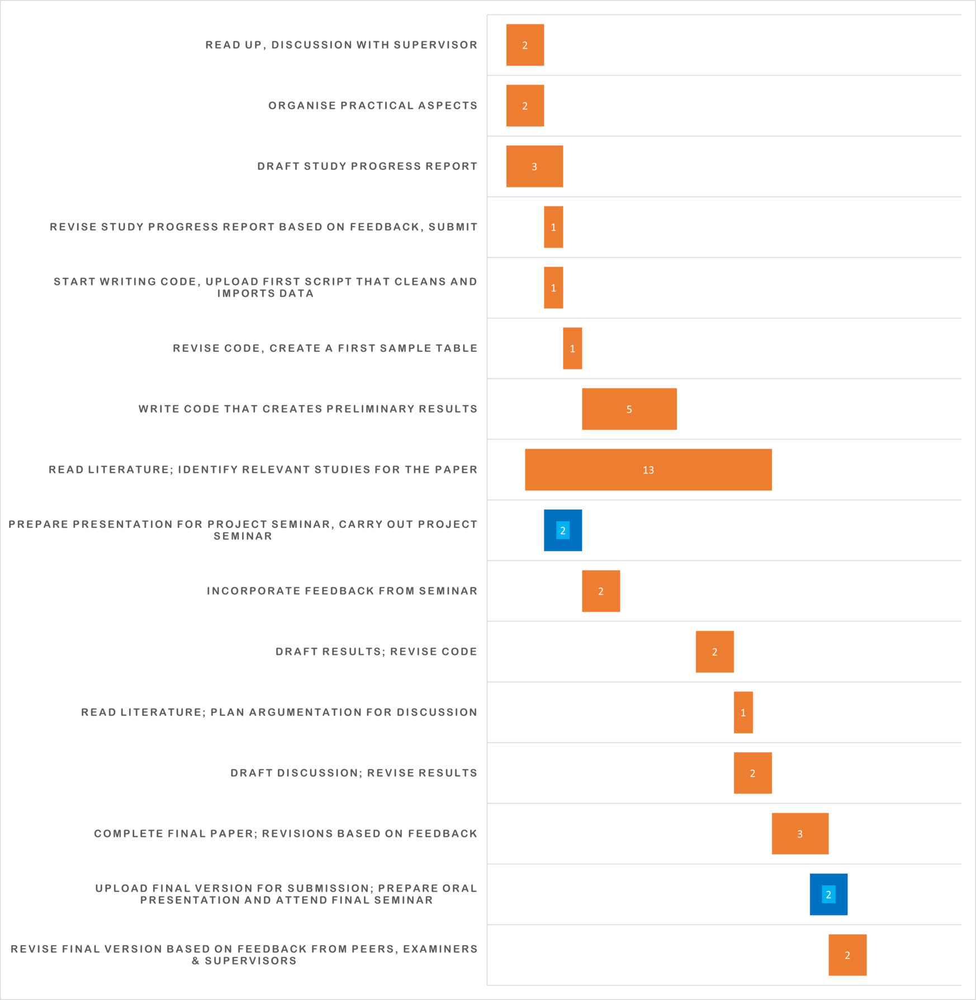

```{r setup, include=FALSE}
knitr::opts_chunk$set(echo = TRUE)
```

Abbreviations
=============
* ASA-PS - American Society of Anesthesiology Physical Status
* KUH - Karolinska University Hospital
* KUH TCQD - Karolinska University Hospital Trauma Care Quality Database
* KUH TR - Karolinska University Hospital Trauma Registry
* NORMIT - Norwegian Survival Prediction Model in Trauma
* OFI - Opportunities for improvement
* Ps - Probability of survival
* TRISS - Trauma and Injury Severity Score

Introduction
============
<!-- Why trauma is a big deal --> 

Traumatic injury is one of the leading causes of death worldwide, constituting nearly 8% of global deaths annually [@whoepi]. The global health burden of physical injury<!-- I typically define trauma as the clinical entity composed of physical injury and the body's associated response. I would suggest that you stick to trauma and don't use physical injury and trauma interchangeably --> has led to trauma being described as a worldwide pandemic. One of the characteristics of this particular pandemic is its demographic spread; trauma is a leading cause of death for people aged 10-49 years [@globalburden] and 90% of trauma-related deaths occur in low- to middle-income countries [@whoepi]. Nonfatal outcomes also comprise a significant portion of the global health burden of disability [@globalburden], which can drastically reduce quality of life and health status in survivors of severe trauma [@globalburden; @longtermtrauma].

Management of severe trauma is highly time-sensitive and is also dependent on the actions of a multidisciplinary chain of healthcare providers. Errors in management are a common cause of preventable deaths [@prevdeathsghorbani; @prevdeathsmontmany; @prevdeathsteixeira]. Outcomes in severe trauma are dependent on the quality of care received, and it has been shown in the US that trauma quality improvement (QI) programs improve outcomes [@ustqi]. However, it has also been shown that the implementation of QI programs differs widely between clinics [@tqipanglo] and there is still progress to be made.  

## Morbidity and mortality conferences

The gold standard of trauma quality improvement programs worldwide are multidisciplinary morbidity and mortality (M&M) conferences.  M&M conferences review selected patient cases and attempt to establish whether there were opportunities for improvement (OFI) in each specific case, and, where necessary, implement corrective actions. The incidence of OFI function in this manner as a proxy for incidence of suboptimal care. The WHO guidelines for trauma quality improvement programmes recommend regularly scheduled multidisciplinary conferences and give specific recommendations as to their structure and format [@whoguidelines]. Despite these  recommendations, there is a still a great degree of variation amongst clinics in how M&M conferences are carried out, with a significant number of clinics still using an informal and unstructured format [@tqipanglo]. The WHO note themselves in their guidelines that M&M conferences are not used to their fullest potential globally [@whoguidelines]. 

The value of M&M conferences in long-term quality improvement is dependent on selection of appropriate cases for review. The process by which patient cases are selected for M&M review differs between clinics and case selection is often non-standardised [@mmreview; @tqipanglo]. This weakness of M&M review has been subject to considerable efforts to develop strategies to standardise case selection. The benefit of standardising case selection is twofold; it could increase identification of the cases that are most likely to have been mismanaged, and it could also save resources in the form of work hours. The latter benefit is not insignificant considering the large caseload found in most urban trauma centres. Some clinics have already made efforts to standardise case election; for example by using quality indicators, or audit filters, to flag cases for inclusion in M&M conferences [@tqipanglo]. Examples of quality indicators include time to first medical contact, adverse event rate, and mortality rate [@developqi]. The WHO recommends that all "deaths, complications, adverse events and errors" should be reviewed [@whoguidelines]. 

<!-- Explain the what and why of TSM -->

## Trauma severity scores
Trauma severity scores (TSS)<!-- Avoid non-standard abbreviations, as it makes your text harder to read. For example, I don't think spelling out trauma severity scores is such a big deal, especially considering that you'll be dealing with so many score names that are abbreviations themselves -->  are used in trauma quality improvement programs and research for their usefulness in benchmarking and in comparing trauma severity between patients [@whoguidelines]. The existence of these models is necessitated by the heterogeneous nature of trauma, due to the variety in its underlying causes, which affect both the type and severity of the injury. This heterogeneity poses challenges in comparing and evaluating trauma outcomes and has spurred the development of multiple TSS. TSS were initially intended for use in prehospital triage, and therefore were simplistic by design for ease of use [@traumareview], but over the years newer and more advanced models have been developed for quality assurance and research purposes. Today there are hundreds of TSS models. These models differ in their methodology but all have the aim of translating injury severity into quantitative values. However, an inherent weakness of any TSS model is that estimates may be unreliable when applied to a population different from the one the model was developed from. Trauma type and severity will differ between locales and trauma patient populations can be difficult to compare between disparate geographical regions. This weakness is one reason why new models continue to be developed and improved around the globe.  

The Trauma and Injury Severity Score (TRISS), first developed in the US in 1987 [@triss] and most recently updated in 2010 [@triss2010], is the most commonly used model worldwide. TRISS is a combination index that incorporates patient age, the Injury Severity Score (ISS), the Revised Trauma Score (RTS), and whether the injury was blunt or penetrating [@triss]. The resulting value is a percentage that estimates the probability of survival (Ps). The ISS gives a score based on the three anatomical regions with the most severe injury. A limitation of the ISS is that it cannot take into account situations where one anatomical region has multiple injuries. The RTS is based on the physiological parameters GCS, systolic blood pressure, and respiratory rate. The RTS is difficult to apply in situations where the patient has already been intubated, which gives TRISS limited value in estimating Ps in certain populations. 

In 2014 researchers in Norway released a new model, Norwegian Survival Prediction Model in Trauma (NORMIT), that attempts to address the weaknesses of TRISS and simultaneously provide a model based on Norwegian patient populations. NORMIT is based on the patient's age, New Injury Severity Score (NISS), comorbidities prior to traumatic injury based on the ASA physical status classification system (ASA-PS), and their RTS. NISS differs from ISS in that NISS allows for scoring of multiple injuries within the same anatomical region. NORMIT also provides a method to apply a GCS score for intubated patients when calculating RTS. 

## Trauma severity scores as indicators for peer review

Some clinics already use TSS as audit filters when selecting cases for M&M review [@whoguidelines]. However, the extent to which TSS are associated with or can predict OFI as found in M&M conferences is not well understood. A study at this institution<!-- This institution? --> found that neither NORMIT nor TRISS were able to reliably discriminate between preventable and non-preventable deaths [@prevdeathsghorbani]. However, that study included only deaths and not other morbidities and thereby had a low sample size. It is not known whether predictive models have better performance when taking into account the entire population of trauma patients. If it could be found that an existing TSS model is associated with OFI, it could allow for another avenue of automatically identifying potentially mismanaged cases in a standardised fashion. The aim of this study is to evaluate how trauma severity models are associated with and to what extent they can predict opportunities for improvement.

<!-- Note that you mix trauma severity scores, trauma severity models, prediction models, etc. Stick to one of these concepts -->
 
Methods 
=======

Study design
------------

<!-- Present key elements of study design -->
This is a single-centre retrospective cohort study, using data from two registries at Karolinska University Hospital (KUH): the trauma registry and the trauma care quality database (TCQD)<!-- I would avoid abbreviating these databases as well-->. The TCQD is a subset of the trauma registry and contains data on trauma patients who were selected for M&M reviews. These two databases will be linked and then analysed to estimate the association between the common TSS models TRISS and NORMIT and OFI using logistic regression. The predictive performance of these models will be evaluated using measures of discrimination and calibration. 

Setting
-------

<!-- Describe the setting, locations, and relevant dates, including
periods of recruitment, exposure, follow-up, and data collection -->

KUH is located in Stockholm, Sweden. KUH's trauma centre is equivalent to a level 1 trauma centre according to American College of Surgeons standards [@nksstats]. KUH is the primary trauma centre for the region of Stockholm and also has agreements with several other regions to provide trauma care for patients with severe trauma. KUH is thereby the major trauma centre for a population of almost 3 million people [@nksstats]. 

The trauma registry at KUH is also submitted to SweTrau, Sweden's national trauma registry database, and therefore meets SweTrau guidelines. SweTrau follows the Utstein Trauma Template for reporting of data following major trauma. The registered data includes prehospital vital signs and management, vital signs and management on arrival at hospital, information about the type of injury, and the primary method of treatment. Follow-up variables include, but are not limited to, survival at 30 days, days in ventilator, GCS at discharge, highest level of care, and transfers to other units.

The TCQD is an internal hospital register and registers the outcome of M&M conferences. Each case reviewed is registered in the trauma care quality register with data about the outcome of the review.

Participants
------------

Participants include all patients registered in both the trauma registry and the TCQD at KUH. <!--När du kommit igång med analysen så ska faktiskt nummer in här (yes ska göra det) --> <!-- Don't include numbers here,  that's for Results --> Furthermore, patients <15 years of age will be excluded as paediatric trauma is a seperate clinical entity. 

### Selection<!-- By selection, do you mean eligibility criteria?--> for the trauma registry

The trauma registry includes all patients for whom the trauma team was activated after receiving a potentially traumatic injury, regardless of NISS score, and all patients with a NISS score >15, regardless of whether the trauma team was activated. Also included are patients who were transferred to the hospital within 7 days of injury and have a NISS score >15. Patients where the only traumatic injury is a chronic subdural hematoma and patients for whom the trauma team was activated without an underlying traumatic injury are excluded from the register.

### Selection for the TCQD

The TCQD contains patients from the trauma registry that were selected for M&M review. At KUH, all fatalities are automatically selected for M&M review. In addition to this, the electronic medical records of all trauma patients are screened by research nursing staff to identify cases that potentially received sub-optimal care. These nurses also use audit filters that automatically highlight cases with abnormal parameters. Cases that two research nurses have evaluated and found to have potential for sub-optimal care are also selected for M&M review.

Variables
---------

<!-- Clearly define all outcomes, exposures, predictors, potential
confounders, and effect modifiers. Give diagnostic criteria, if
applicable. For each variable of interest, give sources of data and
details of methods of assessment (measurement). Describe comparability
of assessment methods if there is more than one group -->
### Outcome
The studied outcome is the binary variable "opportunities for improvement" (OFI), as identified by the multidisciplinary M&M conference at KUH. OFI is coded as either "Yes - at least one opportunity for improvement identified" or "No - no opportunities for improvement identified". 

### Exposures
The primary exposures of interest are trauma severity scores according to the TRISS and NORMIT models. Both of these models estimate the Ps. This is expressed a probability and is a continuous variable. The variables integrated into these models are taken from arrival at hospital. 

#### TRISS

The TRISS model incorporates patient age, Injury Severity Score (ISS), Revised Trauma Score (RTS), and whether the trauma was blunt or penetrating. 

The ISS is given by estimating the severity of physical injuries by anatomical region. Severity is assessed on a seven-point scale from "No injury" to "Unsurvivable injury". The value given is points on a scale from 0 to 75. The RTS is based on physiological parameters GCS, systolic blood pressure, and respiratory rate. Values are taken from arrival at hospital. These parameters are weighted and expressed in a score from 0 to 8, where a lower score indicates more severe injury. 

#### NORMIT

The NORMIT model incorporates the patient's age, New Injury Severity Score (NISS), comorbidities prior to traumatic injury based on the ASA physical status classification system (ASA-PS), and their RTS. 

Bias 
----

<!-- Describe any efforts to address potential sources of bias -->

The method and data analysis model will be written using simulated data to reduce the risk of research bias. Real-world data will only be used once the data analysis model is completed and found to work correctly on simulated data. 

Study size 
----------

<!-- Explain how the study size was arrived at -->

Since all eligible participants must exist in both the trauma and the trauma care quality register, and the trauma care quality registry is a subset of the trauma registry, the number of participants is limited to the number of cases registered in the trauma care quality database. The trauma care quality database includes around 2200 patients who were selected for review between 2014 and 2021. The exact study size has not yet been established at the time of writing this report. 

Quantitative variables
----------------------

The NORMIT and TRISS scores will be calculated using the following variables from the trauma registry database: ISS, NISS, RTS, GCS, systolic blood pressure, respiratory rate, ASA, and age. 


Statistical methods
-------------------

R, a programming language for statistical computing, will be used for compilation and analysis of data. Conversion and handling of variables will be carried out according to the SweTrau manual. This is a complete case study. In cases where data necessary for analysis is missing, i.e. the variables referred to above, the participant will be excluded from the study. Results will be presented with a confidence interval of 95%. A p-value of <0.05 will be considered significant. <!-- The aim includes both to determine association between the severity estimates and OFI as well as how well they predict OFI. These two components require different methods. To determine the strength of the association you could use logistic regression, then the resulting OR would be your effect size. Because all these models returns a probability you don't need to standardise the scores to be able to compare the ORs across models to determine which score that is most strongly associated with OFI. To assess how well they predict OFI you need to calculate the discrimination (often expressed as the area under the receiver operating characteristics curve, or just AUC) and calibration (using for example the integrated calibration index. Note that this is slightly contrived, as that would equate the probability of death with the probability of OFI--> 

Ethical considerations
======================

All patient information used in this study is anonymised and stored in a secure database. Patient medical records will not be accessed. Patients were not asked to give consent for inclusion in the KUH trauma registry. The ability and ethical approval to collect patient data for this registry without pre-emptively asking for patient consent is well-established, as collecting this data is deemed to be in the public interest according to article 6.1 e of GDPR regulations. Collecting data is in the public interest due to the fact that this patient register is used to improve management of trauma, which is a leading cause of death. Patients have the right to be removed from the register if they wish, and also have the right to a copy of data that is stored about them on request.

This project is a retrospective cohort study and the project has thereby had no effect on patient treatment. There is no risk that patients are harmed by inclusion in the study. This study has the potential to improve patient care by analysing a potential factor that could predict suboptimal trauma care. It is true that the patient population for this study includes vulnerable populations, such as the deceased and the severely injured, but this is justified by the fact that this population stands to gain the most from improved trauma care.

**Stockholm Research Ethics Review Board approval number 2021-02541 and 2021-03531.**

<!-- 

source("main.R")  "imports" the main script file of your project and run any code in it -->


Development and time plan
==========

<!--
B) En skriftlig redogörelse på ca en A4-sida av projektets utveckling, plus tidsplan för
resterande del av kursen (använd tidsplanmallen i Canvas). Ange så exakt som möjligt:
• Vilken typ av data, kategorier, variabler etc du avser att samla in
• Hur data planeras presenteras (t ex tabeller och hur de kan struktureras, diagramtyper,
vävnadssnitt, intervjucitat etc)
• Hur data planeras analyseras; vilka statistiska metoder för jämförelser mellan en eller
flera grupper, andra matematiska metoder, kvalitativ analys etc
-->

This is a registry-based project and all data required were collected and available prior to the project beginning. The data consists of information about trauma patients at KUH and the outcomes of morbidity & mortality conferences on selected patient cases. The next step after submitting this progress report is to begin writing the code that will import and clean data. Once this is completed, the code for data analysis will be written. The analysis will consist of using logistic regression to see if trauma severity models can predict opportunities for improvement. Initially the code will be written using scrambled data in order to minimise researcher bias. Once the code for analysis is complete, it will be run on the real-life data to obtain the results for the study. I have written a detailed time plan, including dates for deadlines, that is available for my supervisors. We will be in contact on a regular basis to discuss progress. All of my code and text will be uploaded on a regular basis, which will allow for my supervisors to see my progress. 

```{r, echo=FALSE, out.width = "400px"}

```


References
==========

<!-- Do not edit by hand, references will be inserted and formatted automatically once you knit this document -->
