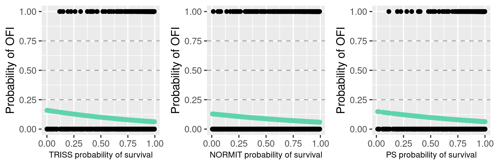

```{r setup, include=FALSE}
knitr::opts_chunk$set(echo = FALSE, warning = FALSE, message = FALSE)
```

```{r ofi-diagram, fig.cap = "", out.width = "400px"}
knitr::include_graphics("images/ofi.png") 
## ofi_diagram.R; save_png(ofi_diagram(), "ofi") to update
```


blabla \@ref(fig:ofi-diagram)

```{r}
knitr::include_graphics("images/acc.png") ## update: acc_x3(t, n, p)
```

```{r}
knitr::include_graphics("images/roc.png") ## update: roc_x3(t, n, p)
```

```{r}
 ## update: glm_x3(df)
```

## R Markdown

This is an R Markdown document. Markdown is a simple formatting syntax for authoring HTML, PDF, and MS Word documents. For more details on using R Markdown see <http://rmarkdown.rstudio.com>.

When you click the **Knit** button a document will be generated that includes both content as well as the output of any embedded R code chunks within the document. You can embed an R code chunk like this:

```{r cars}
summary(cars)
```

## Including Plots

You can also embed plots, for example:

```{r pressure, echo=FALSE}
plot(pressure)
```

Note that the `echo = FALSE` parameter was added to the code chunk to prevent printing of the R code that generated the plot.
